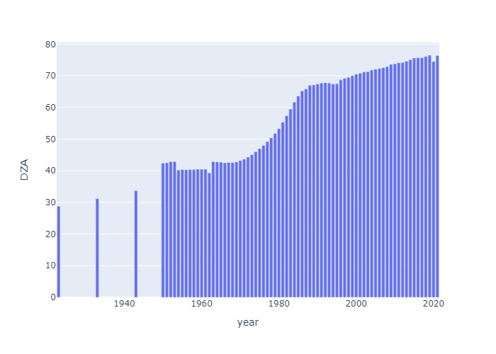
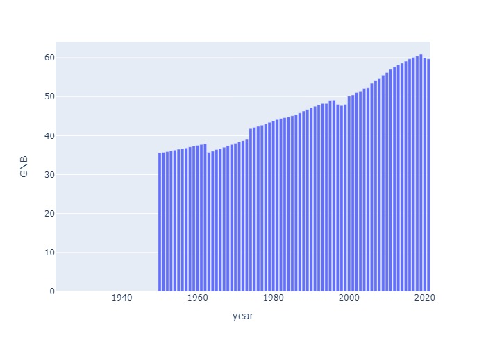

## Comoros Life Expectancy

## Cabo Verde Life Expectancy

## Djibouti Life Expectancy

## Algeria Life Expectancy

## Egypt Life Expectancy

## Eritrea Life Expectancy

## Ethiopia Life Expectancy

## Gabon Life Expectancy

## Ghana Life Expectancy

## Guinea Life Expectancy

## Gambia Life Expectancy

## Guinea-Bissau Life Expectancy

## Equatorial Guinea Life Expectancy

## Kenya Life Expectancy

## Liberia Life Expectancy

## Libya Life Expectancy

## Lesotho Life Expectancy

## Morocco Life Expectancy

## Madagascar Life Expectancy

## Mali Life Expectancy

## Mozambique Life Expectancy

## Mauritania Life Expectancy

## Mauritius Life Expectancy

## Malawi Life Expectancy

## Namibia Life Expectancy

## Niger Life Expectancy

## Nigeria Life Expectancy

## Rwanda Life Expectancy

## Sudan Life Expectancy

## Senegal Life Expectancy

## Sierra Leone Life Expectancy

## Somalia Life Expectancy

## South Sudan Life Expectancy

## Sao Tome & Principe Life Expectancy

## Eswatini Life Expectancy

## Seychelles Life Expectancy

## Chad Life Expectancy

## Togo Life Expectancy

## Tunisia Life Expectancy

## Tanzania Life Expectancy

## Uganda Life Expectancy

## South Africa Life Expectancy

## Zambia Life Expectancy

## Zimbabwe Life Expectancy

